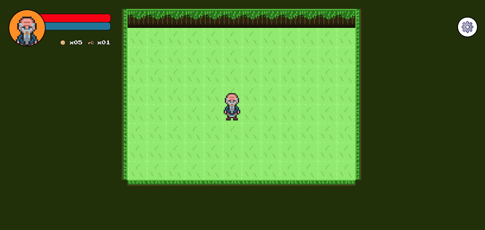

# Game Accessibility: Some Of My Practical Learnings

Check out the live version [here](https://game-accessibility-rpg.vercel.app/)

## 🎯 Motivation an aim

When we create our games, we should make our experiences inclusive for all kinds of users. This includes some visual and/or hearing impairments, but also people with cognitive or motor disabilities. Photosensitive people, people with ASD, learning disorders, and far far more: the list is long and never ending (I wrote a bit about this [here](https://www.manuelsanchezdev.com/blog/people-special-needs-web-accessibility)), that is why it is hard to make that please everybody.

But since we like challenges and learnings, I will try my best to create some cool settings so that (almost) everybody will feel comfortable playing a game in the web!

## 🪜 TO DO for May 2024

- [x] Add dialog possibility
- [x] Add interaction with NPC (change direction, no flags)
- [x] Add basic i18n
- [ ] Add random sound every now and then with subtitles
- [ ] Add settings for subtitles
- [ ] Add letter spacing and line height for dialogues
- [ ] Add input instructions
- [ ] Add possibility of changing the inputs

## Worth mentioning

- Code Foundation is from the amazing course of Drew Conley to create the game Ciabatta's Revenge. You find the end game [here](https://drewconley.itch.io/ciabattas-revenge). Drew has a platform called [co-op mode](https://www.coopmode.dev/) where he teaches Game Dev (it is amazing, really).
- Some of the sprites are open sourced or twisted by me. The guy, though, is from my Pixel Art tutor, Evan, who has some cool packages on [his itch.io page](https://evanwritesgames.itch.io/).
- About me: I am a frontend dev who creates simple-to-complex games for the web. Take web accessibility seriously and want to apply all that knowledge in the game dev field too. You can see some of my games [here](https://msweb-games.vercel.app/)
